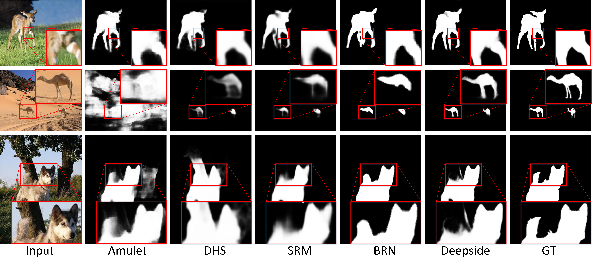

# Deepside
In this paper, we review and draw underlying connections between existing architectures, and show that they actually could be unified into a general framework, which simply just has side structures with different depths. Based on the idea of designing deeper side structures for better detection accuracy, we propose a unified framework called Deepside that can be deeply supervised to incorporate hierarchical CNN features.  
The reason to have deeper side structures, especially for low-level features, is that side structure activation should contain information of finer boundary details of salient objects, and it indicates where salient object boundaries locate. In this sense, such information is a kind of “high-level”information and therefore may require relatively deeper structure to capture it.  

Results for our previous Neurocomputing paper "Deepside: A general deep framework for salient object detection"

## Results
Saliency maps of Deepside on 7 benchmark datasets (ASD, DUT-OMRON, DUTS, ECSSD, HKU-IS, PASCAL-S, SOC) can be found below:  
链接: https://pan.baidu.com/s/1UOmBfjQiNyp1FkfKJ5bovQ 提取码: xcjw  

## Citation
    @article{Fu2019deepside,
      title={Deepside: A general deep framework for salient object detection},
      author={Fu, Keren and Zhao, Qijun and Gu, Irene Yu-Hua and Yang, Jie},
      journal={Neurocomputing},
      volume={356},
      pages={69--82},
      year={2019}
    }
