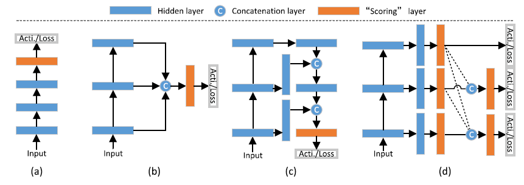
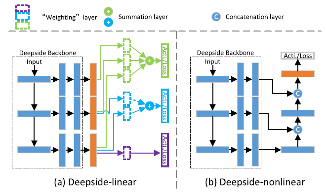

# Deepside
About our previous Neurocomputing paper "Deepside: A general deep framework for salient object detection".
## Introduction
  In this paper, we review and draw underlying connections between existing architectures ((a)-(d)), and show that they actually could be unified into a general framework, which simply just has side structures with different depths. Based on the idea of designing deeper side structures for better detection accuracy, we propose a unified framework called Deepside that can be deeply supervised to incorporate hierarchical CNN features.  
    
  
  The reason to have deeper side structures ((a) and (b)), especially for low-level features, is that side structure activation should contain information of finer boundary details of salient objects, and it indicates where salient object boundaries locate. In this sense, such information is a kind of “high-level”information and therefore may require relatively deeper structure to capture it. More details please see the paper.  
    

## Results
  
Saliency maps of Deepside on 7 benchmark datasets (ASD, DUT-OMRON, DUTS, ECSSD, HKU-IS, PASCAL-S, SOC) can be found below:  
链接: https://pan.baidu.com/s/1UOmBfjQiNyp1FkfKJ5bovQ 提取码: xcjw  
or  
GoogleLink

References of datasets:  
[ASD] Frequency-tuned salient region detection. In CVPR 2009.  
[DUT-OMRON] Saliency detection via graph-based manifold ranking. In CVPR 2013.  
[DUTS] Learning to detect salient objects with image-level supervision. In CVPR 2017.  
[ECSSD] Hierarchical image saliency detection on extended CSSD. IEEE TPAMI, 2015.  
[HKU-IS] Visual saliency based on multiscale deep features. In CVPR 2015.  
[PASCAL-S] The secrets of salient object segmentation. In CVPR 2014.  
[SOC] Salient objects in clutter: bringing salient object detection to the foreground. In ECCV, 2018.  

## Citation
    @article{Fu2019deepside,
      title={Deepside: A general deep framework for salient object detection},
      author={Fu, Keren and Zhao, Qijun and Gu, Irene Yu-Hua and Yang, Jie},
      journal={Neurocomputing},
      volume={356},
      pages={69--82},
      year={2019}
    }
